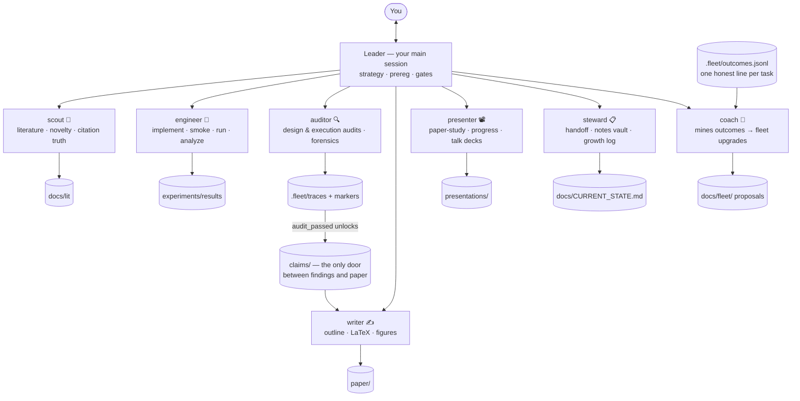

<div align="center">

# ⛵ ResearchFleet

**Spawn your research crew in one command.**

A Claude Code plugin that scaffolds a disciplined ML research project
and staffs it with a seven-agent team — led by your main session as PI.

*a.k.a. **The PI Simulator** — your crew never sleeps, never sulks,
and never claims a result without an audit trail.*

[](LICENSE)
[](https://claude.com/claude-code)
[](ROADMAP.md)
[](CONTRIBUTING.md)

**English** · [中文](README.zh-CN.md)

</div>

---

One command — `/research-init` — gives you three things:

| | |
|---|---|
| 📁 **A disciplined project skeleton** | constitution · preregistrations · claims · audit traces · handoff page — all single-source-of-truth wired |
| 🧑‍🔬 **A seven-agent research team** | scout · engineer · auditor · writer · presenter · steward · coach — each with hard rules and forbidden zones |
| 🧭 **A leader constitution** | your main Claude session becomes the PI: it routes work to the fleet, you just talk to it |

Every mechanism here traces to a documented research failure we personally
paid for — **[docs/lessons.md](docs/lessons.md)**: 15 war stories → 15 mechanisms.

## ⚡ Quickstart

```bash
# 1 · Install (pick one)
claude --plugin-dir /path/to/research-fleet      # local clone
#     …or from a plugin marketplace once published

# 2 · Initialize — three questions: project name, field, target venue
claude
> /research-init

# 3 · Do research by talking to the leader in plain language
> "Has anyone probed VLM hidden states for judge quality?"   # → scout flies
> "Let's preregister the probing experiment"                 # → leader + you, together
> "Implement and run it"                                     # → auditor design-checks, engineer runs
> "Write the results section"                                # → writer (verified claims only)
> "Show me the tree"                                         # → 🌳 watch your project grow
```

No commands to memorize beyond `/research-init` — the generated
`CHEATSHEET.md` is one page, and the leader does the routing.

## 🌰 Philosophy: from a seed to a tree

The goal isn't a PDF. It's **your own research system, grown alongside an
agent team**:

- **You stay in control.** Every judgment call — questions, criteria, gate
  decisions, narrative — is yours by contract. Agents scaffold; they never
  decide.
- **Progress is always visible.** Each line of work moves
  🌰 idea → 🌱 preregistered → 🌿 data → 🪴 audited → 🌳 verified → 🍎 in-paper,
  on one page — and as an animated growing tree (below).
- **You finish knowing more, not less.** Blind spots are surfaced
  (confusion ledgers, placeholders), never smoothed over; a daily Obsidian
  review note turns them into your reading list.
- **Completion is a harvest, not a scramble.** The draft assembles itself
  from verified claims as they mature — by the time the paper is "done",
  it has been done for weeks.

## 🌳 Watch your research grow

Three views over one append-only growth log (`.fleet/growth.jsonl`):

```bash
python tools/growth_tree.py            # docs/fleet/tree.html — animated SVG tree:
                                       #   timeline scrubber · click-a-leaf provenance
                                       #   dead branches kept as honest history
python tools/growth_tree.py --ascii    # the same tree, in any terminal / ssh
```

```
  2026-07-03
  │
  ├─🍎 readout_gap              [paper]    in section 4.1
  ├─✝  fusion_gate              [data]     killed: baseline confound
  └─🪴 visual_leg               [audited]  production queued

  verified+: 1/3 · graveyard: 1
```

And for daily review, the steward maintains an **Obsidian-ready learning
vault** (`notes/`): what moved today, what's worth understanding (harvested
from confusion ledgers and audit verdicts into concept cards you answer
yourself), one linked note per research thread. Your knowledge graph grows
with the tree — and human-written sections are never machine-touched.

## 🧑‍🔬 The fleet



| agent | absorbs | the hard rule that earns its keep |
|---|---|---|
| **scout** 🔭 | lit search · novelty checks · reference verification | zero fabrication — every citation verified live, or marked `[UNVERIFIED]` |
| **engineer** 🔧 | implement · smoke · run · monitor · analyze | fail loud · 3 seeds · held-out always · **cannot change protocol** |
| **auditor** 🔍 | design/experiment/paper audits · reviewer-side forensics | design-audit *before* implementation; verdicts cite `file:key=value` |
| **writer** ✍️ | outline · LaTeX · figures · compile · snapshot drafts | context-isolated: sees only `claims/` + `NARRATIVE.md`; numbers copied, never remembered |
| **presenter** 📽️ | paper-study decks (reverse-learning) · progress decks · talks | figures are PDF screenshots, never redrawn; judgment slides left blank — **no ghostwriting** |
| **steward** 📋 | handoff page · growth log · Obsidian vault · naming lint | summarizes, never judges; no fabricated progress |
| **coach** 🎯 | self-improvement from the outcome ledger | evidence or silence; proposes, **never applies**; no invented metrics |

The leader stays in your main session — strategy needs you anyway, and
resident watcher fleets die of token cost (we tried).

## 🔁 The rhythm of one result

```
prereg → design-audit → smoke → production (3 seeds) → experiment-audit
      → claim (under-review → verified, unlocked by audit marker) → paper
```

Skipping a step doesn't make the result arrive faster; it makes it arrive
twice — the second time from a reviewer. (Exploration lives in the gate-free
`experiments/scratch/` lane; scratch numbers just can't enter claims.)

## 🛡️ Why it's different

1. **Two-context isolation** *(signature)* — your internal ledger
   (`docs/findings/`) stays brutally honest; the writer is firewalled from
   it and works only from audit-gated claims + a story contract. Honesty
   and narrative each get a context where they can be total.
2. **Enforcement lives in files, not vigilance** — claim upgrades require
   an `audit_passed` marker on disk; experiments require a prereg file.
   Rules in prose get skipped; file formats don't.
3. **The fleet improves itself, with evidence** — every task ends with one
   honest line in the outcome ledger; the coach mines it into proposals,
   each citing its evidence, none applied without you.
4. **Anti-slop by mechanism** — no ghostwritten judgments, no redrawn
   figures, no remembered numbers, negative results kept as first-class
   boundary statements.

Independent evaluations of autonomous "AI Scientists" keep concluding they
need the human supervision they claim to remove. ResearchFleet starts where
those evaluations end: **supervision is the product** — we make it cheap and
mechanical. Full failure-mode survey with sources:
[docs/landscape.md](docs/landscape.md).

## 📦 What's in the box

```
agents/                 seven agent definitions (plain Markdown, model-agnostic)
skills/
  research-init/        the /research-init scaffold + all project templates
  shared/references/    contracts: claims · traces · verdicts · run manifests ·
                        outcome ledger · growth log · presentations ·
                        repo discipline · Obsidian vault
docs/
  design.md             architecture & rationale (what we kept from ARIS, what we inverted)
  lessons.md            ★ the 15 failures this framework is made of
  landscape.md          competitive failure-mode survey + differentiation
examples/demo-project/  a scaffolded project with a living growth tree
```

## 🚧 Status — v0.1, young and opinionated

Honest per our own rules: the **disciplines** are distilled from a year of
real, documented research cycles (including one full postmortem); the
**plugin packaging** is new and still accumulating miles. By our own standard
that makes the framework `indicative`, not `verified` — pilot it, and your
`.fleet/outcomes.jsonl` plus an issue is exactly the feedback the coach was
built to consume. Roadmap: [ROADMAP.md](ROADMAP.md).

## 🙏 Lineage & credits

ResearchFleet is a role-based reorganization of ideas we battle-tested with
[**ARIS**](https://github.com/wanshuiyin/Auto-claude-code-research-in-sleep)
(Auto-Research-In-Sleep, AAAI'26) and its reviewer-side dual
[**Anti-Autoresearch**](https://github.com/wanshuiyin/Anti-Autoresearch) —
see [docs/design.md](docs/design.md) for what we kept, inverted, and why.
If you want overnight autonomous research, use ARIS; if you want a
disciplined crew with you as PI, you're in the right repo.

## License

[MIT](LICENSE)
