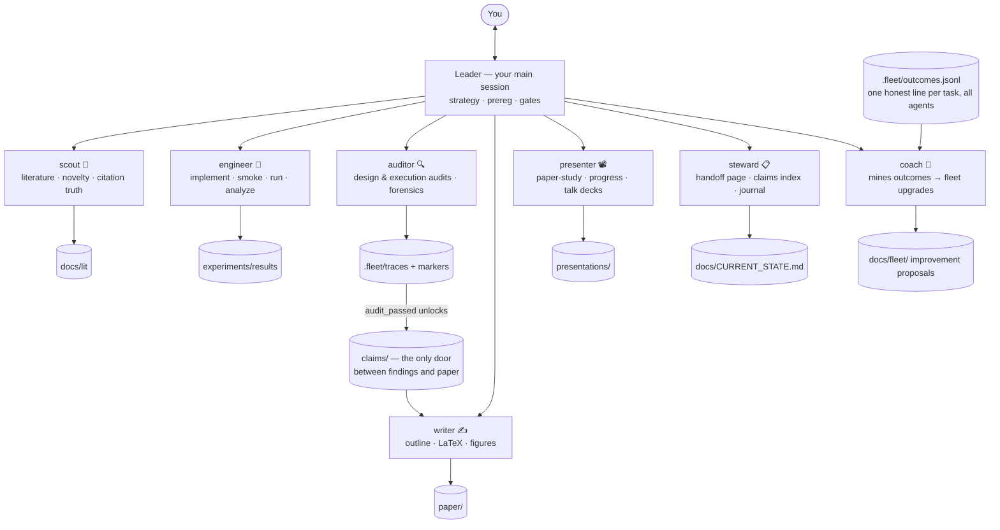

# ResearchFleet ⛵

> **Spawn your research crew in one command.**
> A Claude Code plugin that scaffolds a disciplined ML research project and
> staffs it with a seven-agent team — led by your main session as PI.
>
> *a.k.a. **The PI Simulator** — every grad student deserves to know what
> running a lab feels like. Your crew never sleeps, never sulks, and never
> claims a result without an audit trail.*

[English](README.md) · [中文](README.zh-CN.md) · MIT License

---

**One command** (`/research-init`) gives you:

- 📁 A **research project skeleton** — code, paper and experiment assets with
  single-source-of-truth wiring (constitution, preregistrations, claims,
  audit traces, handoff page)
- 🧑‍🔬 A **seven-agent fleet** — scout, engineer, auditor, writer, presenter,
  steward, coach — each a specialist with hard rules and forbidden zones
- 🧭 A **leader constitution** (project `CLAUDE.md`) that turns your main
  Claude session into the PI: it routes work to the fleet, you just talk to it

Built from a year of real, painful, LLM-agent-driven research — every
mechanism traces to a documented failure
(**[docs/lessons.md](docs/lessons.md)**: 15 war stories → 15 mechanisms).

## Why

Agentic research tooling has a paradox: the more honestly your agents record
what happened, the worse your paper gets — dead ends and self-criticism flood
the writing context until the paper reads like an apology. And the more rules
you write, the more get skipped under deadline pressure.

ResearchFleet's two answers:

1. **Two-context isolation.** Your internal ledger (`docs/findings/`) stays
   brutally honest. The writer agent is *firewalled* from it — it writes only
   from `claims/` (audit-gated, verified results with usage boundaries) and a
   story contract (`paper/NARRATIVE.md`). Honesty and narrative each get a
   context where they can be total.
2. **Enforcement lives in files, not vigilance.** Claim upgrades require an
   `audit_passed` marker on disk. Experiments require a preregistration file.
   The paper requires verified claims. Rules in prose get skipped; file
   formats don't.

## Why not a fully-autonomous "AI Scientist"?

Independent evaluations of autonomous-scientist systems keep reaching the
same verdict: shallow novelty checks, no critical assessment of their own
results, hallucinated citations, and a hard dependency on human supervision
they claim to remove. Multi-agent frameworks add their own tax: ~3× token
footprints, chat loops, coordination overhead.

ResearchFleet starts where those evaluations end: **supervision is the
product.** You keep the judgment calls; the fleet makes supervision cheap and
mechanical (independent adversarial audits, file-level gates, zero standing
agent cost). Full failure-mode analysis with sources:
[docs/landscape.md](docs/landscape.md).

## Quickstart

```bash
# 1. Install the plugin (pick one)
claude --plugin-dir /path/to/research-fleet      # local
# or add via your plugin marketplace once published

# 2. In your (new) project directory
claude
> /research-init
# answers three questions: project name, field, target venue

# 3. Do research by talking to the leader
> "Has anyone probed VLM hidden states for judgment quality?"   # → scout flies
> "Let's preregister the probing experiment"                    # → leader + you
> "Implement and run it"                                        # → auditor design-checks, engineer runs
> "Write the results section"                                   # → writer (verified claims only)
```

## The fleet



| agent | absorbs | hard rule that earns its keep |
|---|---|---|
| **scout** | lit search, novelty check, reference verification, anchor hunting | zero fabrication — every citation verified live, or marked `[UNVERIFIED]` |
| **engineer** | implement, smoke, run, monitor, analyze | fail loud; 3 seeds; held-out always; **cannot change protocol** |
| **auditor** | design/experiment/paper audits, reviewer-side forensics | design-audit *before* implementation; verdicts cite `file:key=value`; blame our own code before the finding |
| **writer** | outline, LaTeX, figures, compile | context-isolated: sees only `claims/` + `NARRATIVE.md`; numbers copied, never remembered |
| **presenter** | paper-study decks (reverse-learning), progress decks, talk slides | figures are PDF screenshots, never redrawn; judgment slides (limitations/conclusions) left blank — **no ghostwriting** |
| **steward** | handoff page, claims index, journal, graveyard | summarizes, never judges; no fabricated progress |
| **coach** | self-improvement: mines the outcome ledger for recurring friction → proposals for CLAUDE.md / agents / templates | evidence or silence (≥2 cited entries per proposal); proposes, **never applies**; no invented metrics |

The leader stays in your main session — strategy and gate decisions need you
anyway, and resident watcher fleets die of token cost (we tried).

**The fleet improves itself — with evidence.** Every agent ends every task by
appending one honest line to `.fleet/outcomes.jsonl`: what worked, what
fought it. The coach periodically mines that ledger (plus audit traces and
the graveyard) and proposes upgrades to the project constitution, agent
definitions and templates — each proposal citing the entries that motivated
it, none applied without your approval.

## The rhythm of one result

```
prereg → design-audit → smoke → production (3 seeds) → experiment-audit
      → claim (under-review → verified, unlocked by audit marker) → paper
```

Skipping a step doesn't make the result arrive faster; it makes it arrive
twice — the second time from a reviewer.

## What's in the box

```
agents/            seven agent definitions (plain Markdown)
skills/
  research-init/   the /research-init scaffold + all project templates
  shared/references/  contracts: claim schema · trace format · verdict format · run manifest
docs/
  design.md        architecture & rationale
  lessons.md       ★ the 15 failures this framework is made of
```

## Status — v0.1, young and opinionated

Honest per our own rules: the **disciplines** are distilled from a year of
real, documented research cycles (including one full postmortem); the
**plugin packaging itself** is new and still accumulating miles. By our own
standard that makes the framework `indicative`, not `verified` — pilot it,
and your `.fleet/outcomes.jsonl` plus an issue is exactly the feedback the
coach agent was built to consume.

## Lineage & credits

ResearchFleet is a role-based reorganization of ideas we battle-tested with
[**ARIS**](https://github.com/wanshuiyin/Auto-claude-code-research-in-sleep)
(Auto-Research-In-Sleep, AAAI'26) and its reviewer-side dual
[**Anti-Autoresearch**](https://github.com/wanshuiyin/Anti-Autoresearch) —
see [docs/design.md](docs/design.md) for exactly what we kept, inverted, and
why. If you want overnight autonomous research, use ARIS; if you want a
disciplined crew with you as PI, you're in the right repo.

## License

MIT
