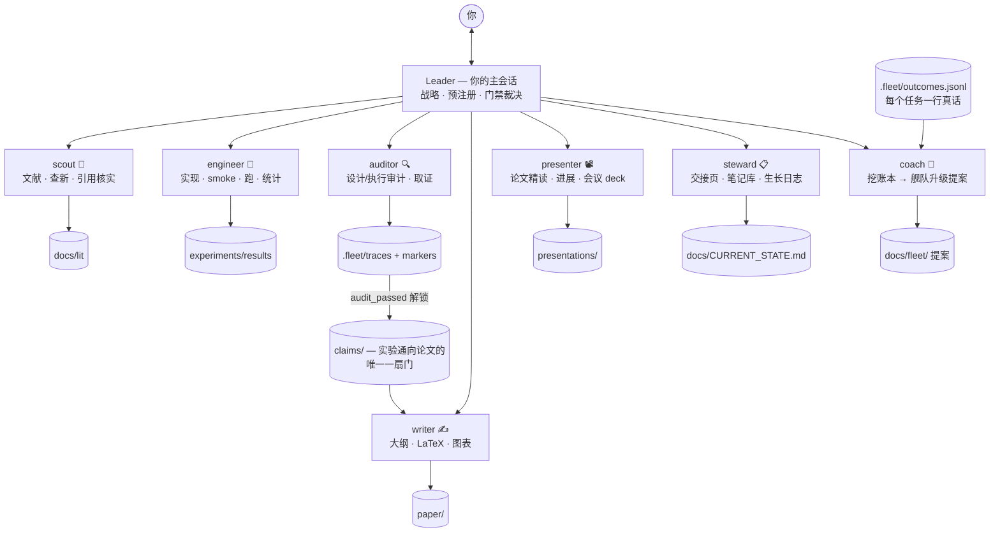

<div align="center">

# ⛵ ResearchFleet

**一条命令，组建你的科研团队。**

Claude Code 插件：一键搭好一个讲规矩的 ML 科研项目，
再配上七个各司其职的 agent——你的主会话坐 PI 的位置。

*绰号 **PI 模拟器**：这支队伍不用睡觉、没有情绪，
而且没有审计记录时，谁也不敢跟你报结果。*

[](https://github.com/shanyuzhe/research-fleet/actions)
[](LICENSE)
[](https://claude.com/claude-code)
[](ROADMAP.md)
[](CONTRIBUTING.md)

[English](README.md) · **中文**

</div>

---

市面上的"AI 科学家"都在想办法替掉研究者本人，而各家独立评测的结论出奇一致：
去掉人的监督，产出就不可信。ResearchFleet 反过来做——**自动化的不是研究者，
而是实验室的那套规矩；PI 的位置始终是你的。**

一条 `/research-init`，你得到三样东西：

| | |
|---|---|
| 📁 **规矩齐全的项目骨架** | 宪法 · 预注册 · claim 文件 · 审计记录 · 交接页——单一事实源接好线，所有门禁一条命令就能体检 |
| 🧑‍🔬 **七个分工明确的 agent** | scout · engineer · auditor · writer · presenter · steward · coach——每个都有硬规矩和不许碰的禁区 |
| 🧭 **一部 Leader 宪法** | 主会话自动就任 PI：活儿它来分派，你只管说人话 |

这里每一条机制背后，都是一次我们真金白银交过学费的失败——
**[docs/lessons.md](docs/lessons.md)**：15 个坑，换来 15 条机制。

## ⚡ 快速开始

```bash
# 1 · 安装（二选一）
claude --plugin-dir /path/to/research-fleet      # 本地克隆
#     …或等上架 plugin marketplace 后直接装

# 2 · 初始化——只问三件事：项目名、研究方向、目标 venue
claude
> /research-init                    # 单人小项目可加 --minimal

# 3 · 之后就是正常聊天做科研
> "有人探测过 VLM 隐层表征的判断质量吗？"    # → scout 出动查文献
> "把这个 probing 实验预注册了"               # → leader 陪你一起写
> "实现并跑起来"                               # → auditor 先审设计，engineer 再动手
> "把结果章节写了"                             # → writer 动笔（只认 verified claim）
> "给我看看树"                                 # → 🌳 看项目一路长起来
```

要记的命令只有 `/research-init` 这一条——生成的 `CHEATSHEET.md` 一页纸，
剩下的路由都是 leader 的活儿。

## 🧑‍🔬 这支队伍



| agent | 管什么 | 保命的那条硬规矩 |
|---|---|---|
| **scout** 🔭 | 文献检索 · 查新 · 引用核实 | 零编造——每条引用当场联网核实，核不动就标 `[UNVERIFIED]` |
| **engineer** 🔧 | 实现 · smoke · 跑 · 监控 · 统计 · method card | fail loud · 3 个 seed · 永远 held-out · **没有改协议的权力** |
| **auditor** 🔍 | 设计/执行/论文三级审计 · 取证 · 可选跨模型复核 | 设计审计先于写代码；verdict 逐条给 `file:key=value` 证据 |
| **writer** ✍️ | 大纲 · LaTeX · 图表 · 编译 · 快照草稿 | 上下文隔离：只看 `claims/` 和 `paper/`（方法细节走 method card）；数字只许粘贴，不许背 |
| **presenter** 📽️ | 论文精读 deck（反向学习法）· 进展汇报 · 会议 talk | 图只能截论文 PDF，不许重画；观点页留白给你——**不代笔** |
| **steward** 📋 | 交接页 · 生长日志 · Obsidian 笔记库 · 命名规范 | 只记录不评判；没进展就写没进展 |
| **coach** 🎯 | 从 outcome 账本里挖改进 | 拿不出证据就闭嘴；**只提案，不动手**；不许编指标 |

Leader 故意不做成 agent——战略本来就离不开你，而常驻监工型舰队全都死于
token 账单（我们亲测过）。

## 🔁 一个结果的完整节奏

```
预注册 → 设计审计 → smoke → production（3 seed）→ 实验审计
      → claim（under-review → verified，由 audit marker 解锁）→ 论文
```

跳过任何一步，结果不会来得更快，只会来两次——第二次是审稿人替你跑的。
（想随手试东西？`experiments/scratch/` 不设门禁，随便玩；只是 scratch 里
出生的数字永远进不了 claim。）

## 🛡️ 规矩是可以 grep 的

大多数"纪律框架"就是一篇模型迟早会无视的散文。这里的规矩住在三层里，
一层比一层硬：

1. **文件层**——claim 想升 `verified`？磁盘上先得有 `audit_passed`
   marker；实验想开跑？先有预注册文件。
2. **脚本层**——`python tools/fleet_status.py` 一条命令，把所有门禁不变量
   （claim↔marker、孤儿 marker、预注册在不在、manifest 全不全、evidence
   路径、树和账本对不对得上）渲染成红黄绿看板，exit code 直接接 CI。
3. **hook 层（可选）**——[`hooks/`](hooks/README.md) 把 claim 门禁装进
   Claude Code 的工具调用层：一次没有合法审计记录就想把 status 改成
   `verified` 的编辑，会被**机械地拒绝**，而不是被温柔地提醒。hook 管不住
   的部分，同一份文档里如实写清了边界。

再加上招牌机制——**双上下文隔离**：内部账本 `docs/findings/` 里可以残酷
诚实（负结果、kill 判决、自我怀疑），writer 被防火墙隔在外面，只从过审的
claim、故事契约和 method card 下笔。于是诚实归诚实，叙事归叙事，两边都
不用打折。

## 🌳 看着你的研究长大

一份 append-only 的生长日志（`.fleet/growth.jsonl`），三种看法：

```bash
python tools/growth_tree.py            # 生成 docs/fleet/tree.html — SVG 动画树：
                                       #   时间轴拖动 · 点叶子看来龙去脉
                                       #   枯枝保留，作为诚实的历史
python tools/growth_tree.py --ascii    # 同一棵树，任何终端 / ssh 里直接看
```

```
  2026-07-03
  │
  ├─🍎 readout_gap              [paper]    已进论文 §4.1
  ├─✝  fusion_gate              [data]     已 kill：baseline 混淆
  └─🪴 visual_leg               [audited]  production 排队中
```

日常复盘交给 **Obsidian 笔记库**（`notes/`）：steward 把 confusion 账本和
审计判决收割成概念卡片，答案留给你亲手写。项目做完，你懂的东西变多了
而不是变少了——盲点全被摆上台面，而不是被顺滑的文字糊过去。

## 📦 仓库里有什么

```
agents/                 七个 agent 定义（纯 Markdown，不绑定特定模型）
commands/               /research-init 命令（薄壳，转发给 skill）
skills/
  research-init/        脚手架 skill + 全套项目模板
                        （含 fleet_status.py 和 growth_tree.py，init 时拷进项目）
  shared/references/    带版本号的契约层：claim · trace · verdict · method card ·
                        run manifest · outcome 账本 · 生长日志 · 汇报 ·
                        仓库纪律 · Obsidian 笔记
hooks/                  可选的 harness 级门禁（见 hooks/README.md）
tools/                  仓库自身的 CI 检查（agent lint、模板完整性、计数一致性）
docs/
  design.md             架构与取舍（从 ARIS 继承了什么、反转了什么、为什么）
  lessons.md            ★ 铸成这套框架的 15 次失败
  landscape.md          竞品失败模式调研 + 差异化定位
examples/demo-project/  一个初始化完的示例项目，生长树是活的——CI 盯着它保持全绿
```

## ❓ 常见问题

**和 [ARIS](https://github.com/wanshuiyin/Auto-claude-code-research-in-sleep) 什么关系？**
同一批伤疤，两种相反的姿势：ARIS 是*你睡觉时它做研究*；ResearchFleet 是
*你坐镇当 PI，队伍在你眼皮底下干活*。想要过夜的自动化产出，用 ARIS；
想要便宜又机械化的监督，就是这个仓库。（渊源细节：[docs/design.md](docs/design.md)。）

**能不能只用契约、不用 agent？**
能。`skills/shared/references/` 下全是纯 Markdown，不依赖任何 agent——
claim 格式、trace 格式、verdict 格式放进哪套工作流都能用（它们本来就比
这个插件出生得早）。agent 的作用只是让"守规矩"变成阻力最小的那条路。

**token 花销什么量级？**
设计上处处抠：一个任务一个 agent、在清晰的边界处才 spawn、不搞常驻监工
（试过，账单先死）、deck 审查分层、大多数问题 leader 读个文件就能答。
预期是每次委派一段 agent 对话，而不是一窝蜂。单人项目再加 `--minimal`，
仪式感进一步砍半。

## 🚧 现状 — v0.2，按自家规矩如实交代

**这套纪律**提炼自一整年有据可查的真实科研周期（含一次完整的项目复盘）；
**插件这个载体**还年轻，里程还在攒。按我们自己的口径，整个框架目前算
`indicative`，还不算 `verified`——升级路径是完整跑通一个试点项目。欢迎
试用：你的 `.fleet/outcomes.jsonl` 加一个 issue，正是 coach 天生要吃的
反馈。路线图见 [ROADMAP.md](ROADMAP.md)。

## 🙏 渊源与致谢

ResearchFleet 是把 [**ARIS**](https://github.com/wanshuiyin/Auto-claude-code-research-in-sleep)
（Auto-Research-In-Sleep，AAAI'26）与其审稿人侧对偶项目
[**Anti-Autoresearch**](https://github.com/wanshuiyin/Anti-Autoresearch)
一年实战里验证过的想法，按科研组的角色重新组织的产物——保留了什么、
反转了什么、为什么，见 [docs/design.md](docs/design.md)。

## License

[MIT](LICENSE)
