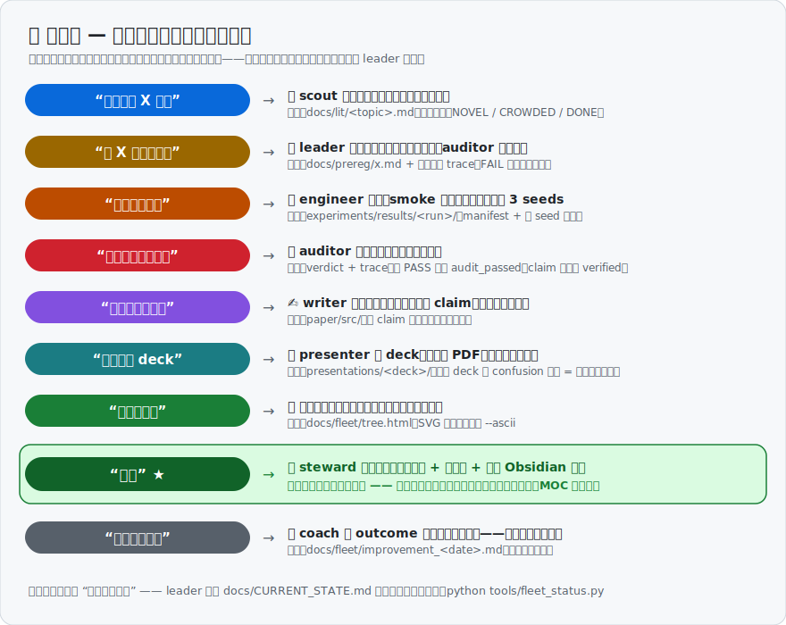

<div align="center">

# ⛵ ResearchFleet

**一条命令，给你的科研项目配一支不敢糊弄你的 AI 团队。**

*又名「PI 模拟器」：组员不睡觉、不闹情绪，
而且没有审计记录时，谁也不敢跟你报结果。*

[](https://github.com/shanyuzhe/research-fleet/actions)
[](LICENSE)
[](https://claude.com/claude-code)
[](ROADMAP.md)
[](CONTRIBUTING.md)

[English](README.md) · **中文**

</div>

---

用 AI 做科研的人，迟早会撞上同一个问题：**AI 说得太流畅了，流畅到你分不清
哪句是真的。** ResearchFleet 是一个 Claude Code 插件，它不让 AI 替你做研究，
而是给 AI 立规矩——让它做的每件事都留下证据，让它想糊弄你的时候糊弄不成。

## 这些坑，你踩过几个？

- 📉 **"这个数是哪来的？"** —— 论文里有个 87.3，你找了半小时，找不到当初
  是哪次实验、什么配置跑出来的。
- 🎲 **换个随机种子，结论就变了** —— 但 deadline 前没人想知道这件事。
- ✍️ **AI 写作太"贴心"** —— 帮你写论文时，顺手把一个没验证过的数写得斩钉
  截铁，甚至编出一条不存在的参考文献。
- 🧠 **隔一周回来，大脑一片空白** —— 上次做到哪了？哪些方向试过已经死了？
  全靠翻聊天记录考古。
- 😶 **项目做完，你却更心虚了** —— 一堆 AI 生成的结果和文字，组会上被追问
  两句就答不上来。

这些不是 AI 的锅，是**没有流程管着 AI** 的锅。真实的实验室靠一套规矩活着：
先登记再实验、有人审核才算数、写论文只许引用核实过的结论。ResearchFleet
把这套规矩搬进你的 Claude Code 项目里，并且让它**自动执行**。

## 装上之后，你的项目变成什么样

| 以前 | 以后 |
|---|---|
| 论文里的数字来路不明 | 每个数字都能一路追溯到生成它的那次实验和配置文件 |
| AI 说"验证过了"你只能信 | 想标"已验证"？磁盘上必须先有审核记录，没有就**机械地拒绝**，AI 说破嘴也没用 |
| 写作 AI 想写啥写啥 | 写论文的 AI 被隔离在"只能看核实过的结论"的房间里，想编也没材料 |
| 项目状态存在你脑子里 | 任何时候回来，读一页交接文档就知道：做到哪、下一步、哪些路已经死了别再走 |
| 进度看不见摸不着 | 一棵会生长的树🌳：每条研究线从想法→实验→验证→进论文，枯枝也留着（诚实的历史） |
| AI 替你形成观点 | 结论、判断、局限性这些页面永远留白给你写——**它不代笔** |

一句话：**你当老板（PI），七个 AI 员工干活，每个员工都有不敢越过的红线。**

## ⚡ 上手：一条命令 + 说人话

```bash
# 1 · 安装
claude --plugin-dir /path/to/research-fleet

# 2 · 初始化——只问三件事：项目叫什么、研究什么、投哪里
claude
> /research-init          # 单人小项目可加 --minimal

# 3 · 之后就是正常聊天
> "有人做过 X 吗？"            # → 文献员出动，每条引用当场核实
> "我们把这个实验登记一下"      # → 和你一起写实验计划（做什么、成功标准、什么情况认输）
> "实现并跑起来"                # → 审核员先挑设计毛病，工程师再动手
> "把结果章节写了"              # → 写手动笔，只用过了审的结论
> "给我看看树"                  # → 🌳 看项目长到哪了
```

要记的命令只有 `/research-init` 一条。剩下的调度是"老板会话"自己的事，
你只管用中文（或任何语言）提要求。

## 🗣️ 九句口令，就是全部操作

不用背命令，也不用记 agent 名字——下面九句话（或者你自己的任何说法）
覆盖从开题到投稿的所有日常。**绿色那句最重要：不说"收尾"，笔记库就不长。**



<details>
<summary>文字版（方便复制粘贴）</summary>

| 你说 | 谁动 | 落盘什么 |
|---|---|---|
| **`“有人做过 X 吗？”`** | 🔭 scout 查新，引用当场核实 | `docs/lit/` |
| **`“把 X 预注册一下”`** | 📝 leader 陪你定判据和认输条件，auditor 审设计 | `docs/prereg/` + 审计 trace |
| **`“实现并跑起来”`** | 🔧 engineer：smoke → 3 seeds | `experiments/results/` |
| **`“这些数是真的吗？”`** | 🔍 auditor 逐数对文件 | verdict + `audit_passed` |
| **`“把结果章节写了”`** | ✍️ writer 防火墙内下笔 | `paper/src/` |
| **`“做个进展 deck”`** | 📽️ presenter，观点页留白 | `presentations/` |
| **`“给我看看树”`** | 🌳 生长树 | `tree.html` / 终端 |
| **`“收尾”`** ★ | 📋 steward 收割一整天 | 状态页 + 生长树 + **全套 Obsidian 笔记** |
| **`“优化一下舰队”`** | 🎯 coach 带证据提案 | `docs/fleet/` 提案 |

</details>

📖 **想看完整流程？** [docs/GUIDE.zh-CN.md](docs/GUIDE.zh-CN.md)——每个
agent 什么时候出动、一条研究线的一生、笔记的 SOP 生成点地图、每天
10 分钟的知识内化仪式。

## 👥 七个员工，各管一摊

| 谁 | 干什么 | 它不敢做的事 |
|---|---|---|
| 🔭 文献员 scout | 查文献、查新、核实引用 | 编造引用——核实不了就老实标"未核实" |
| 🔧 工程师 engineer | 写代码、跑实验、盯训练、算统计 | 私自改实验方案；报单次运行当结论 |
| 🔍 审核员 auditor | 实验前审设计、出结果审数字、投稿前审全文 | 给面子——每条结论必须给出文件级证据 |
| ✍️ 写手 writer | 大纲、LaTeX、图表、编译 | 看内部工作记录（防止编故事）；凭记忆写数字 |
| 📽️ 汇报员 presenter | 论文精读 PPT、进展汇报、会议 talk | 重画论文里的图（只许截图）；替你写观点页 |
| 📋 管家 steward | 交接文档、进度树、学习笔记库 | 评判结果；把"没进展"写成"有进展" |
| 🎯 教练 coach | 复盘工作记录，提改进建议 | 没证据就发言；不经你同意就改任何东西 |

老板（leader）不是 AI 员工——就是你正在聊天的主会话，加上一部"宪法"教它
怎么分派活、什么时候必须来问你。

---

<details>
<summary><b>🔬 技术细节（点开看：机制、强制力、目录结构、FAQ）</b></summary>

## 一个结果的完整节奏

```
预注册 → 设计审计 → smoke 测试 → 正式跑（3 seeds）→ 实验审计
      → claim（under-review → verified，由审计 marker 解锁）→ 论文
```

跳过任何一步，结果不会来得更快，只会来两次——第二次是审稿人替你跑的。
想随手试东西？`experiments/scratch/` 不设门禁；只是 scratch 里出生的数字
永远进不了 claim。

## 规矩是可以 grep 的——三层强制力

1. **文件层**——claim 想升 `verified`？磁盘上先得有 `audit_passed`
   marker；实验想开跑？先有预注册文件。规则活在文件格式里，不靠自觉。
2. **脚本层**——`python tools/fleet_status.py` 一条命令，把所有门禁不变量
   （claim↔marker、孤儿 marker、预注册在不在、manifest 全不全、evidence
   路径、树和账本对不对得上）渲染成红黄绿看板，exit code 直接接 CI。
   每个检查项都做过破坏测试：人为制造违规，逐项能红。
3. **hook 层（可选）**——[`hooks/`](hooks/README.md) 把 claim 门禁装进
   Claude Code 的工具调用层：没有合法审计记录就想把 status 改成
   `verified` 的编辑，会被**拦截拒绝**，理由回显给模型。hook 管不住的
   部分（如"只有审核员能写 marker"），文档里如实写明了边界。

## 招牌机制：双上下文隔离

内部账本 `docs/findings/` 里可以残酷诚实——负结果、kill 判决、自我怀疑
全都记。写手被防火墙隔在外面，只从三样东西下笔：过审的 claim（结果）、
method card（方法细节，从 run manifest 逐字段拷贝）、故事契约
NARRATIVE.md（怎么讲）。于是内部诚实可以彻底，论文叙事也可以彻底，
互不污染。

## 生长树

一份 append-only 生长日志，三种视图：

```bash
python tools/growth_tree.py            # docs/fleet/tree.html — SVG 动画树
python tools/growth_tree.py --ascii    # 终端/ssh 里直接看
```

```
  2026-07-03
  │
  ├─🍎 readout_gap    [paper]    已进论文 §4.1
  ├─✝  fusion_gate    [data]     已 kill：baseline 混淆
  └─🪴 visual_leg     [audited]  production 排队中
```

日常复盘走 Obsidian 笔记库（`notes/`）：没搞懂的问题被收割成概念卡，
答案留给你亲手写——项目做完，你懂的东西变多而不是变少。

## 仓库里有什么

```
agents/                 七个 agent 定义（纯 Markdown，不绑定特定模型）
commands/               /research-init 命令入口
skills/
  research-init/        脚手架 + 全套项目模板（含 fleet_status.py、growth_tree.py）
  shared/references/    带版本号的契约层：claim · trace · verdict · method card ·
                        run manifest · outcome 账本 · 生长日志 · 汇报 · 仓库纪律
hooks/                  可选的 harness 级门禁（见 hooks/README.md）
tools/                  仓库自身的 CI 检查
docs/
  lessons.md            ★ 铸成这套框架的 15 次真实失败
  design.md             架构与取舍 · landscape.md  竞品失败模式调研
examples/demo-project/  一个初始化完的示例项目，CI 盯着它保持门禁全绿
```

## 常见问题

**和 [ARIS](https://github.com/wanshuiyin/Auto-claude-code-research-in-sleep) 什么关系？**
同一批伤疤，两种相反的姿势：ARIS 是*你睡觉时它做研究*；ResearchFleet 是
*你坐镇当 PI，队伍在你眼皮底下干活*。想要过夜的自动化产出，用 ARIS；
想要便宜又机械化的监督，用这个。（渊源：[docs/design.md](docs/design.md)）

**能不能只用契约、不用 agent？**
能。`skills/shared/references/` 下全是纯 Markdown，放进任何工作流都能用。
agent 的作用只是让"守规矩"变成阻力最小的那条路。

**token 花销什么量级？**
处处抠：一个任务一个 agent、不搞常驻监工（试过，账单先死）、PPT 审查
分层、大多数问题主会话读个文件就能答。单人项目加 `--minimal` 再砍一半
仪式。

</details>

## 🚧 现状 — v0.2，按自家规矩如实交代

**这套纪律**提炼自一整年有据可查的真实科研周期（含一次完整复盘）；
**插件载体**还年轻。按我们自己的口径，框架目前算 `indicative`，还不算
`verified`——升级路径是完整跑通一个试点项目。欢迎试用：你的
`.fleet/outcomes.jsonl` 加一个 issue，正是 coach 天生要吃的反馈。
路线图：[ROADMAP.md](ROADMAP.md)。

## 🙏 渊源与致谢

ResearchFleet 是把 [**ARIS**](https://github.com/wanshuiyin/Auto-claude-code-research-in-sleep)
（AAAI'26）与其对偶项目 [**Anti-Autoresearch**](https://github.com/wanshuiyin/Anti-Autoresearch)
一年实战验证过的想法按科研组角色重新组织的产物。每一条机制背后都是一次
真金白银的失败：**[docs/lessons.md](docs/lessons.md)**，15 个坑换来 15 条机制。

## License

[MIT](LICENSE)
